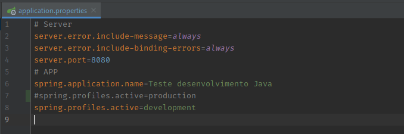
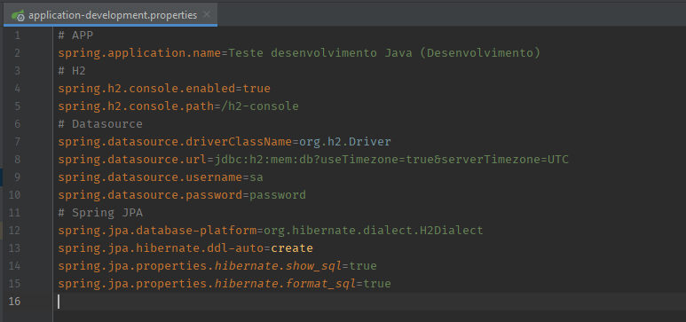
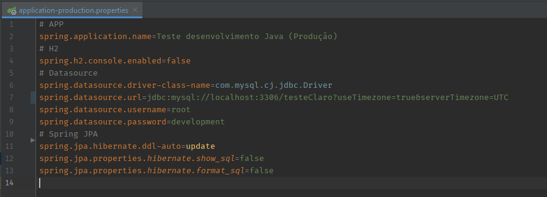
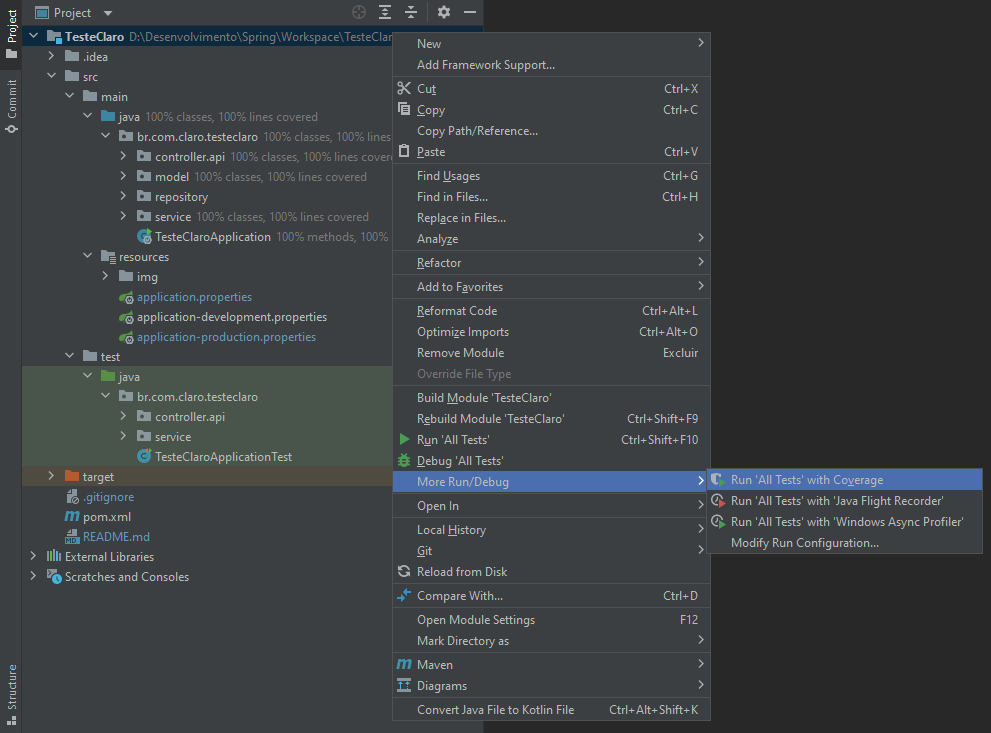

# Avaliação para Analista Desenvolvedor Java

Esta aplicação foi desenvolvida utilizando:

* IntelliJ IDEA [2021.2.1](https://www.jetbrains.com/pt-br/idea/download/#section=windows) Ultimate
* Java [1.8.0_301](https://www.oracle.com/br/java/technologies/javase/javase-jdk8-downloads.html#license-lightbox)
* SpringBoot 2.5.4
* H2 Database
* MySQL
* Lombok
* JUnit5
* Para preenchimento do endereço, foi utilizada a API [ViaCep](https://viacep.com.br/)
* Para consumo do endpoint, foi utilizado o
  Postman [v8.11.1](https://www.postman.com/downloads/?utm_source=postman-home)

### Guia de Utilização

Antes de iniciar é necessário informar no application.properties se o ambiente será o de testes ou de produção, conforme
imagem abaixo:



Caso seja iniciado no ambiente de testes, a aplicação irá salvar todas as requisições no banco H2 (que é excluído sempre
que o serviço for parado).



Caso seja iniciado no ambiente de produção será necessário criar um novo schema no MySQL e informar no
application-production.properties o datasource.url, username e password para funcionar a aplicação.



Após o serviço estar iniciado, é necessária a utilização do Postman (ou aplicação semelhante) para consumo da API. O
endpoint disponível é:

`/api/contatos`

#### Este endpoint responde com os seguintes métodos:

* POST:
    * Necessário informar um body no formato JSON contendo:
        * e-mail.
        * nome.
        * telefone.
        * cep.

      ###### Exemplo:
        ```
        {  
            "email": "teste@teste.com",  
            "nome": "Contato de Teste",  
            "telefone": "(67) 99999-9999",  
            "cep": "79002-000"  
        }
        ```

* GET:
    * Sem informar nenhum parâmetro:  
      Retorna uma lista com todos os contatos já cadastrados, ou uma lista vazia caso não existam registros.
    * Informando um e-mail válido como parâmetro:  
      Retorna um JSON contendo os dados do contato.
    * Informando um e-mail inválido como parâmetro:  
      Retorna um status 404, informando que não foi encontrado um contato.

* DELETE:
    * Sem informar nenhum parâmetro:  
      Retorna um status 405, informando que este método não é permitido.
    * Informando um e-mail válido como parâmetro:  
      Faz a exclusão do contato informando uma mensagem de sucesso.
    * Informando um e-mail inválido como parâmetro:  
      Retorna um status 404, informando que não foi encontrado um contato para ser excluído.

* PUT:
    * Necessário informar um e-mail válido como parâmetro.
    * Necessário preencher **todos os dados obrigatórios** do contato (caso não seja informado retorna erro dos campos _
      not null_).
      ###### Exemplo:
      ```
      /api/contatos/email@valido.com
      
      {
          "nome": "Contato atualizado",
          "telefone": "(67) 99999-9999",
          "cep": "79050190"        
      }
      ```
* PATCH:
    * Necessário informar um e-mail válido como parâmetro.
    * Atualiza somente os dados informados no corpo da requisição.
      ###### Exemplo:
      ```
      /api/contatos/email@valido.com
      
      {
        "nome": "Contato atualizado"
      }
      ```

### Testes

Para o desenvolvimento dos testes, foi utilizado o JUnity5 e para verificar a cobertura dos testes, foi utilizado o
Coverage do próprio Intellij.


